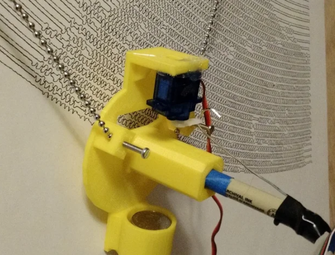

## Inspirations

### Existing builds:

- [BLACKBOARD V-PLOTTER](https://www.instructables.com/BLACKBOARD-V-PLOTTER/) by tuenhidiy

- [CNC Hanging Plotter](https://www.instructables.com/CNC-HANGING-PLOTTER/) by lingib

- [XY Plotter Drawing Robot | Arduino | Polargraph](https://www.instructables.com/XY-Plotter-Drawing-Robot-Arduino-Polargraph/) by MertArduino

### Designs:

- [Makelangelo](http://www.makelangelo.com/) by Marginally Clever Robots, Limited

  

  

- [MTvplot](https://www.thingiverse.com/thing:2371117/files) by Michi_Teck

  

- [Polargraph](https://www.thingiverse.com/thing:575487/files) by jolars

  

  

- [Fumik](https://www.fumik.com/) - Fixed belt
  
  